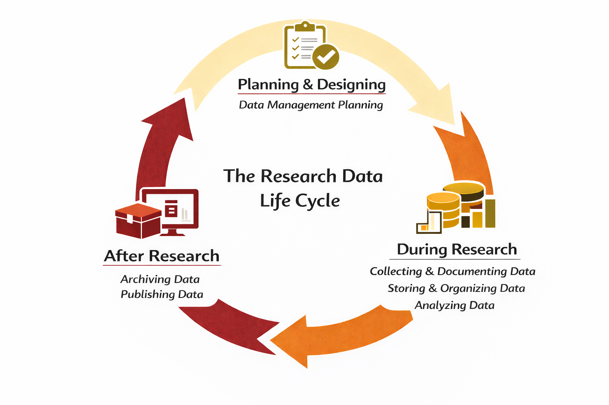

# Structure of this book {#sec-intro_structure}

The IRAS Research Data Management guidelines are structured according to the Research Data Life Cycle (@fig-rdl). This cycle can be broadly divided into three phases: before (i.e. planning and designing), during and after research. Research data management (RDM) activities and actions take place during all three phases.

{#fig-rdl}
